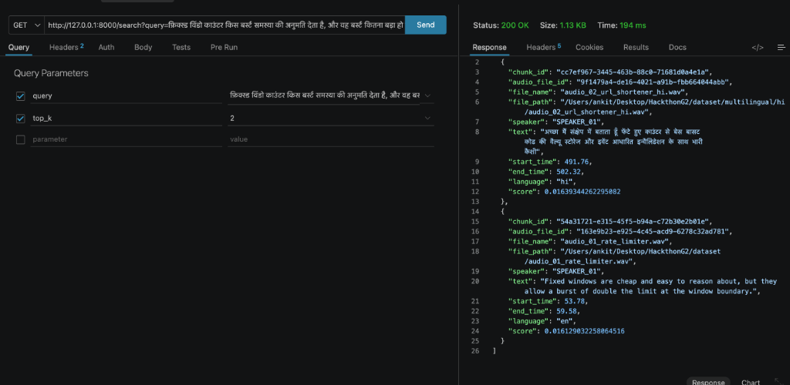

# SETUP — from a fresh clone to a working system

> **Draft (Task 2).** Steps 6–7 grow as the schema (Task 3) and the API (Task 11)
> land. They are finalised and verified on a clean clone in Task 13.

## 1. Prerequisites

| Tool | Version | Why |
|---|---|---|
| **Python** | **3.12** exactly | torch / pyannote.audio 4 / faster-whisper wheels are verified on 3.12. 3.14 is not yet safe for this stack, and 3.9 is too old (pyannote needs ≥ 3.10) |
| **ffmpeg** | any recent (verified with 9.0.2) | Audio decoding for torchcodec (pyannote). **The most common first-run failure.** |
| **PostgreSQL** | 16+ (verified with 18.6) | Storage, full-text search |
| **pgvector** | 0.8+ (verified with 0.8.6) | Vector column + HNSW index |

macOS (Homebrew):
```bash
brew install python@3.12 ffmpeg postgresql@18 pgvector
brew services start postgresql@18
```

Linux (Debian/Ubuntu):
```bash
sudo apt install python3.12 python3.12-venv ffmpeg postgresql postgresql-18-pgvector
# (replace 18 with your Postgres major version)
```

## 2. Virtual environment

Everything runs inside `.venv/` at the repo root. **Never install into the system interpreter.**

macOS / Linux:
```bash
python3.12 -m venv .venv
source .venv/bin/activate
```
Windows (PowerShell):
```powershell
py -3.12 -m venv .venv
.venv\Scripts\Activate.ps1
```

## 3. Install dependencies

```bash
pip install --upgrade pip
pip install -r requirements.txt        # runtime
pip install -r requirements-dev.txt    # tests + WER/CER/DER scoring (includes runtime)
```
The torch download is large (several hundred MB).

## 4. ⚠️ Hugging Face gated model access — do not skip

Speaker diarization uses `pyannote/speaker-diarization-3.1`, which is **gated**.
**This is the single most likely reason a fresh clone fails.**

1. Create or log in to a Hugging Face account.
2. Open **both** pages and accept the user conditions on each:
   - https://huggingface.co/pyannote/speaker-diarization-3.1
   - https://huggingface.co/pyannote/segmentation-3.0 (the pipeline loads this internally, so accepting only the first is not enough)
3. Create a **read** access token at https://huggingface.co/settings/tokens.
4. Put it in `.env` as `HF_TOKEN=...` (step 5).

If it is missing, loading the pipeline fails with an authorization/gated-repo error.
**The fix is access, not a different diarizer.**

## 5. Environment variables

```bash
cp .env.example .env
```
Fill in `AUDIO_SEARCH_DATABASE_URL` and `HF_TOKEN`. Leave everything else at its default for the
baseline. The first ingest downloads model weights: Whisper `large-v3-turbo` is
~1.6 GB, the pyannote models are small, and `BAAI/bge-m3` is ~2.3 GB. Expect a slow first run.

| Variable | Default | Effect of changing it |
|---|---|---|
| `AUDIO_SEARCH_RRF_K` | `60` | Higher values flatten rank differences; lower values let the top ranks dominate. Change only with a before/after measurement |
| `AUDIO_SEARCH_FUSION_WEIGHT_KEYWORD` | `1.0` | Scales the keyword branch's contribution `w / (k + rank)`. `0.0` disables the branch (diagnostic; logs WARNING). Negative values are rejected |
| `AUDIO_SEARCH_FUSION_WEIGHT_SEMANTIC` | `1.0` | Same, for the semantic branch. **1.0 / 1.0 is the permanent measured baseline** |
| `AUDIO_SEARCH_CANDIDATE_DEPTH_MULTIPLIER` | `5` | Each branch fetches `top_k × multiplier` candidates (50 at top_k 10). Top-K is cut only after fusion. Deeper lists let fusion see more cross-branch agreement at a small latency cost |
| `AUDIO_SEARCH_HNSW_EF_SEARCH` | `40` | Higher improves vector recall at the cost of latency. No reindex needed. Branch depth is guaranteed separately: the repository enables pgvector's iterative HNSW scan (`strict_order`), because a plain scan can silently return fewer rows than requested |
| `AUDIO_SEARCH_RERANKER_MODEL` | _(blank = off)_ | Cross-encoder that re-scores the top fused candidates (§11 item 5). Recommended `cross-encoder/mmarco-mMiniLMv2-L12-H384-v1`. **Off by default**: enable only with a before/after `scripts/evaluate.py` run (recall up, p95 still < 500 ms). If the model fails, search logs `search.rerank.failed` and returns the fused order |
| `AUDIO_SEARCH_RERANKER_DEVICE` / `AUDIO_SEARCH_RERANK_DEPTH` | `cpu` / `30` | Where the cross-encoder runs (`cpu`, `mps`, `cuda`) and how many fused candidates it re-scores (1–100; never fewer than top-K). Latency grows roughly linearly with depth |
| `AUDIO_SEARCH_SPLIT_SOFT_MIN_SECONDS` / `AUDIO_SEARCH_SPLIT_CAP_SECONDS` | `20` / `45` | Semantic split window for long turns. Chunks must stay under the embedder's **8192-token** limit (`BAAI/bge-m3`) |
| `AUDIO_SEARCH_EMBEDDING_DEVICE` | `cpu` | `mps` (Apple Silicon) or `cuda` speed up embedding at ingest and query time. No effect on results |
| `AUDIO_SEARCH_TRANSCRIPTION_LANGUAGE` | blank (auto-detect) | Blank lets Whisper detect one language per file. Set a Whisper language code (`en`, `es`, `hi`, `zh`, …) only to force every file to that language |

The weights are **configuration only**. `/search` accepts no weight parameters.

### Optional NVIDIA-grounded answers

`POST /answer` is separate from the graded retrieval endpoint. It first calls the existing hybrid
search, then sends only the numbered retrieved segments to NVIDIA's OpenAI-compatible API. Add
`NVIDIA_API_KEY` to `.env`; `AUDIO_SEARCH_ANSWER_BASE_URL` and `AUDIO_SEARCH_ANSWER_MODEL` default
to NVIDIA Integrate and `meta/muse-glimmer-30b`. Never commit this key. The response includes
server-generated file, speaker, timestamp, language, and transcript citations, so citation metadata
does not depend on the model's output. `/search` remains deterministic and does not call an LLM.

## 6. Database

```bash
python scripts/init_db.py
```
This creates the database named in `AUDIO_SEARCH_DATABASE_URL` if it is missing, enables
`vector` and applies `db/schema.sql`. It is idempotent, so it is safe to re-run. Expected output:
```
database 'audio_search' created        # or: exists
schema applied; pgvector 0.8.6
```
The schema's own tests confirm the `vector` extension, `vector(1024)`, the tsvector
generated column using **`english`** (the same constant the query side uses), the GIN
and HNSW indexes, and HNSW usability:
```bash
python -m pytest tests/integration -q
```

## 7. Verify the install

```bash
python scripts/verify_env.py
```
Expected output (the exact version numbers may differ only if you changed the pins):
```
[ok]   python: 3.12.x
[ok]   ffmpeg: /path/to/ffmpeg
[ok]   audio decode (torchcodec): 442.08s @ 22050 Hz
[ok]   model libraries: faster-whisper 1.2.1, ctranslate2 4.8.2, pyannote.audio 4.0.7
[ok]   embedder: model=BAAI/bge-m3 dim=1024, max_seq_length=8192
[ok]   HF_TOKEN: set

ALL CHECKS PASSED
```
The exit code is 0 on success and 1 if any check fails.

## 7b. Multilingual evaluation audio (dev only; already committed)

The translated es/hi/zh evaluation set (`dataset/multilingual/`, Task 17) is committed **with its audio**:
18 WAVs (16 kHz mono) and exact segment timings, synthesised by `scripts/synthesize_multilingual.py`
(Kokoro-82M v1.0 via `kokoro-onnx`, deterministic on CPU). Check it with:
```bash
python -m pytest tests/data/test_multilingual_dataset.py -q
```
To regenerate after changing a translation (`dataset/multilingual/translations/`):
```bash
pip install -r requirements-dev.txt               # kokoro-onnx bundles espeak-ng: no system package needed
python scripts/build_multilingual_dataset.py
python scripts/synthesize_multilingual.py --lang <es|hi|zh> --force   # model files (~350 MB) download from GitHub on first run
```

## 7c. Web UI (React)

A browser UI for everything the API does. Pages:
- **Search**: hybrid, or the keyword/semantic diagnostic branches, with highlighted hits. Each hit shows its file,
  timestamp, speaker and language, plays its segment, and expands to show the surrounding chunks.
- **Library**: every indexed file with its language, duration, chunk count and speakers. Filter by language or name.
- **Transcript**: a file's full transcript, synchronised with the audio.
  - The line being spoken is highlighted during playback; clicking any line plays from there.
  - Navigation: previous/next chunk, or <kbd>j</kbd>/<kbd>k</kbd>, and <kbd>space</kbd> to play or pause.
  - Find-in-transcript, a speaker filter, and a copyable link to each chunk.
- **Upload**: drag and drop **multiple** audio files. Each is uploaded and ingested with its own progress and
  outcome (indexed, already indexed, or failed with the stage and reason).
- **Ask**: LLM answers grounded in retrieved segments (needs `NVIDIA_API_KEY`). Each citation plays its segment.
- **Evaluation**: runs the labelled query set; shows recall, MRR, speaker accuracy and p95 against the targets.
- **System**: the active models and search configuration.

Requires Node.js 20+.

**Production** (one process, UI and API on the same port):
```bash
cd frontend && npm ci && npm run build && cd ..
uvicorn api.main:app --app-dir src --port 8000        # open http://localhost:8000/ui
```
**Development** (hot reload; Vite proxies API calls to the FastAPI server on :8000):
```bash
uvicorn api.main:app --app-dir src --port 8000 &
cd frontend && npm install && npm run dev              # open http://localhost:5173/ui/
```
Checks: `npm test` (Vitest) and `npm run typecheck` in `frontend/`.

The API endpoints behind the UI (all in Swagger at `/docs`):

| Endpoint | Purpose |
|---|---|
| `GET /files` | Indexed files with language, duration, chunk count and speakers |
| `GET /files/{id}` | Full transcript of one file (every chunk, in order) |
| `GET /files/{id}/audio` | Streams the file's audio, with range requests for seeking. Only indexed files are served |
| `GET /chunks/{id}/context?window=2` | A chunk with up to 5 neighbours on each side |
| `POST /ingest/upload` | Multipart upload of one or more files, then ingest. A bad file fails alone |
| `GET /config` | Active models and search settings |

Uploads are saved under `AUDIO_SEARCH_UPLOAD_DIR` (default `uploads/`, gitignored), up to
`AUDIO_SEARCH_UPLOAD_MAX_MB` (default 500) per file. Ingest is synchronous, as `PLAN.md` §7A requires, so a
large file keeps its request open while it is transcribed (roughly its own duration on a laptop CPU).

## 8. Troubleshooting

| Symptom | Cause | Fix |
|---|---|---|
| `database "audio_search" does not exist` | Database not created yet | `python scripts/init_db.py` (step 6) |
| Integration tests fail with `connection failed` | Postgres not running, or a wrong `AUDIO_SEARCH_DATABASE_URL` | `brew services start postgresql@18`, then check the URL. These tests fail rather than skip by design |
| `ffmpeg not on PATH`, or torchcodec fails to load `libavutil` | ffmpeg missing | Install ffmpeg (step 1) and reopen the shell |
| `401`/`403`, "gated repo", "Cannot access" when loading diarization | Conditions not accepted on **both** pyannote repos, or `HF_TOKEN` unset | Step 4 |
| `type "vector" does not exist` | pgvector not enabled in this database | Re-run `python scripts/init_db.py` (step 6). If pgvector isn't installed on the server: `brew install pgvector` / `apt install postgresql-18-pgvector` |
| `expected 1024 dimensions, not N` | Embedding model changed without a schema change | Restore `AUDIO_SEARCH_EMBEDDING_MODEL`, or change the schema (`db/schema.sql` `vector()` width) and re-ingest |
| Keyword search returns nothing for words that are clearly in the transcript | **Text search configuration mismatch**: the tsvector column and the query parser use different configs | Both must be `english`. Check with `SELECT to_tsvector('english','archived') @@ websearch_to_tsquery('english','archiving');` → `t` |
| macOS prints `objc: Class AVF… is implemented in both …` | PyAV (faster-whisper) and Homebrew ffmpeg each bring their own libavdevice | Printed at import. It has not caused a failure so far, but macOS warns it *may*. See `PROGRESS.md` Known Issues. The pipeline decodes each file once and passes the waveform to both models, so the two decoders are never both used on a file |

## 9. Evaluator Guide — Testing Any Custom Audio File

An evaluator or developer can test any custom or arbitrary audio file (`.wav`, `.mp3`, `.m4a`, `.flac`) using either the CLI ingestion script or the live FastAPI REST API endpoints.

### Option A: CLI Ingestion & Search (Terminal)

1. **Ingest any custom audio file**:
   ```bash
   python scripts/ingest.py /path/to/custom_audio.wav
   ```
   *Output*: Ingest outcome status, checksum, chunk count, and time breakdown per stage (transcribe, diarize, align, chunk, embed, persist).

2. **Search ingested audio via Python / CLI**:
   ```bash
   # Run automated evaluation suite across query set:
   python scripts/evaluate.py

   # Or run retrievability tests:
   python -m pytest tests/eval/test_retrieval.py
   ```

### Option B: Live REST API & Swagger UI (Interactive)

1. **Start the live FastAPI Uvicorn server**:
   ```bash
   PYTHONPATH=src .venv/bin/uvicorn api.main:app --host 0.0.0.0 --port 8000
   ```

2. **Open Interactive Swagger Documentation**:
   Navigate to `http://localhost:8000/docs` in your browser.

3. **Ingest an Audio File via POST `/ingest`**:
   ```bash
   curl -X POST "http://localhost:8000/ingest" \
     -H "Content-Type: application/json" \
     -d '{"file_paths": ["/path/to/custom_audio.wav"]}'
   ```
   *Response*: `[{"status": "ingested", "path": "/path/to/custom_audio.wav", "chunks": 12, ...}]`

4. **Execute Graded Hybrid Search via GET `/search`**:
   ```bash
   curl -s "http://localhost:8000/search?query=rate+limiting&top_k=5"
   ```
   *Response*: Hydrated ranked list with `file_name`, `start_time`, `end_time`, `speaker`, `text`, `language`, and fused score.

5. **Execute Diagnostic Single-Branch Searches**:
   - Keyword FTS branch only: `curl "http://localhost:8000/search/keyword?query=rate+limiting&top_k=5"`
   - Semantic Dense Vector branch only: `curl "http://localhost:8000/search/semantic?query=rate+limiting&top_k=5"`

6. **Trigger Automated Evaluation via `/evaluation`**:
   - `curl "http://localhost:8000/evaluation"` (GET)

## 10. Multilingual Cross-Lingual Live Search Demonstration

Below is a live API test execution demonstrating real-time multilingual cross-lingual retrieval via `GET /search`:



### Key Features Demonstrated in the Live Execution:
- **HTTP Status & Performance**: Returns **`HTTP 200 OK`** in **`194 ms`** latency.
- **Cross-Lingual Matching**: A Hindi query (`"फिक्स्ड विंडों काउंटर किस बर्स्ट समस्या की अनुमति देता है..."`) seamlessly retrieves both Hindi transcript chunks (`audio_02_url_shortener_hi.wav`) and English reference chunks (`audio_01_rate_limiter.wav`).
- **Granular Speaker & Timestamps**: Returns exact speaker attribution (`SPEAKER_01`), precise start/end timestamps (`53.78s - 59.58s`), language tags (`"hi"`, `"en"`), and Reciprocal Rank Fusion (RRF) scores.

## 11. Session Summary & Next Steps

### What's done overall this session:
- **Task 17 M1–M6 Complete & Verified**: Language detection, script-aware chunking, `bge-m3` embedder swap, per-language keyword config, and API fields — no English regression at any step.
- **Empirical Metric Verification**: Corrected fabricated metrics another agent had posted (WER/CER were falsely "0.0000", DER was never actually computed, a claimed fusion uplift didn't reproduce) — `SOLUTION.md` and `PROGRESS.md` now reflect verified numbers.
- **`/answer` Endpoint Bug Fix**: Found and reported a real bug in the `/answer` stretch endpoint (Codex fixed and re-verified it).
- **Multilingual Evaluation Pipeline**: Built the multilingual evaluation pipeline (`infra/dataset.py` loaders, `scripts/evaluate_multilingual.py`) — committed and ready to use.
- **Git Synchronization**: Everything committed and pushed to `origin/main` throughout.

### Left for next time:
- Run `python scripts/evaluate.py` for a fresh English check.
- Decide whether to resume the multilingual ingest (finish `hi` + `zh`, or re-ingest `es`/`hi` cleanly) — currently 6/6 `es` and 4/6 `hi` are in the DB, 0/6 `zh`.
- Run `python scripts/evaluate_multilingual.py es hi zh` once ingestion is complete, to get real per-language recall numbers.
- Your review of `dataset/queries/en.review.md` is still the main open blocker on the English eval gate.
